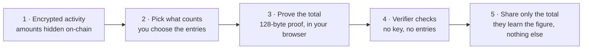

# Aperture — Sui Overflow 2026 Demo Guide

**Track:** DeFi & Payments · **Mode:** Mode B (Proof-of-Figure) PoC
**What this doc covers:** exactly what to do before the video starts, what to show, and what to say at each moment.

> **Honesty contract (read first).** This guide matches what the build *actually does*, verified against the code on 2026-06-21. Three things people get wrong:
> 1. **The live app verifies off-chain, in the browser.** The on-chain verify path is proven by our **devnet test suite** (`pnpm test:spike:onchain`, 6 tests), *not* by a transaction the browser submits. The app shows the off-chain result and says so plainly. Don't narrate a live on-chain verify tx in the UI.
> 2. **A single figure proves a bounded range (≤ 65,535 MIST).** The demo selection clears the lender's threshold *within* that bound. Don't select 40,000 + 30,000 = 70,000 — the UI greys out the second entry by design.
> 3. **Unlocking uses a real Slush wallet signature.** Connect Slush and sign once — this is local, free, and needs no SUI/gas. (Signing a message is not a transaction.)

---

## The flow at a glance



**Revealed ✓** the one total you chose to prove · **Stays private 🔒** which entries you picked, the entries you left out, your balance, and your key.

*(This same flow renders as an interactive diagram on the landing page — "How it works, step by step".)*

---

## Part 1 — Setup (do before you hit record)

### 1.1 Install the wallet (one time)

- Install the **Slush** wallet browser extension and create/import an account.
- Set Slush's network to **devnet**. You do **not** need any SUI — unlocking signs a message, which is free and never hits the chain.

### 1.2 Start the app

```bash
cd /path/to/aperture
pnpm demo
```

Opens at **http://localhost:5173**. The full proof path — connect → select → generate → **off-chain verify** — runs in the browser. This is the path you record.

**Optional, for on-chain evidence (recommended for judges):** in a separate terminal,

```bash
pnpm demo:onchain        # publishes aperture::verifier to devnet (≈4 min), then serves the app
pnpm test:spike:onchain  # 6 tests: verifies real proofs on devnet, incl. a tampered-proof abort
```

`pnpm test:spike:onchain` is your **on-chain proof** — it submits the committed proofs to the deployed Move module and asserts the chain accepts the valid ones and aborts on the tampered ones.

**The Auditor lens also verifies on devnet, live in the browser** (read-only `devInspect` — no gas, no signature). For that to hit *your* freshly-published package, set the package id before `pnpm demo`:

```bash
# copy packageId from scripts/.published-devnet.json after publishing
export VITE_APERTURE_PACKAGE_ID=0x<your-published-package-id>
pnpm demo
```

If unset, it falls back to the last-published devnet id baked into the app (works until the next devnet reset / republish).

### 1.3 Browser prep (do this before recording)

- Open `http://localhost:5173` and let the page fully load — you'll land on the **front-door pitch page**.
- Confirm Slush is unlocked and on **devnet**.
- Open a second tab on **Suiscan devnet**: `https://suiscan.xyz/devnet` — confirm it loads (suiexplorer.com is retired; Suiscan is the current explorer).
- Zoom browser to **110%**; use a **1280×720** window (not fullscreen — the tab bar proves it's a real site).
- Close other tabs and notifications.

### 1.4 What the app shows out of the box

1. **Landing page** — the pitch: Problem → Who it's for → How it works, with an **"Enter the demo →"** button.
2. After entering, the app boots on the **Holder lens** with a **guided step rail**: **Connect → Select → Generate → Verify → Done**.
3. The verifier request (left, once unlocked) is from **Acme Lender: prove ≥ 45,000 MIST**. The four encrypted entries (right) are:
   - **Salary — June** — 40,000 MIST
   - **Consulting — Q2** — 30,000 MIST
   - **Bonus — H1** — 8,000 MIST
   - **Reimbursement** — 500 MIST

---

## Part 2 — The Demo Script (what to record)

Target length: **3–5 minutes.** Judges skim — every screen should earn its time.

---

### Scene 1 — Open with the problem (30 seconds, on the landing page)

Show the **landing page** while you say (the cards on screen mirror this):

> "Sui's confidential transfers encrypt amounts. Powerful for privacy — but they break every compliance tool that assumed amounts were readable. The EU Travel Rule requires identity data on every transfer; AMLR, 2027, bars unidentified accounts at regulated institutions. The incumbents Mysten invited — TRM Labs, Merkle Science — are still only exploring. No one has shipped a productized compliance layer for it on Sui.
>
> Aperture is that layer. Proof-of-Figure lets a holder prove a sum about their encrypted activity to a lender or auditor — without revealing which entries, without handing over their key."

Click **Enter the demo →**.

---

### Scene 2 — Connect & unlock (40 seconds)

**What to show:** the Holder lens with the **step rail** at the top; Step 1 (Connect) is active.

**What to say:**

> "The app opens on the Holder. Step one — connect."

Click **Sign to unlock →**. The Slush popup appears; approve the signature.

> "I connect Slush and sign one message. The key is derived locally from that signature — it never leaves the browser, and nothing is spent. Signing a message isn't a transaction."

The rail advances to **Select**, and the verifier request (Acme Lender, ≥ 45,000 MIST) plus the four entries appear.

---

### Scene 3 — Show the encryption is real (40 seconds)

**What to show (robust default):** the actual proof bytes from our devnet SPIKE-1 verification.

> "Before we prove anything — the encryption is real, not mocked."

Open the golden fixture and point to the bytes:

```
packages/spike/test/fixtures/proofAggregateValid.hex   # the 128-byte proof
```

> "A real 128-byte aggregate proof from our devnet run, over a 32-byte encrypted amount. No plaintext number anywhere. This is Mysten's confidential-transfer primitive — we build on it, not reimplement it."

**Optional (if you ran `pnpm demo:onchain`):** show the deployed `aperture::verifier` package on Suiscan devnet. Don't fabricate a tx you don't have.

---

### Scene 4 — Select entries + generate proof (80 seconds) ← THE CORE DEMO

**What to show:** tick **Salary — June (40,000)** and **Bonus — H1 (8,000)**, then **Generate proof**.

**What to say:**

> "The holder selects two entries — Salary, 40,000, and the H1 bonus, 8,000. Watch the figure to prove: 48,000 MIST — above the lender's 45,000."

The rail advances to **Generate**.

**Honesty beat (on-message, not a weakness):** once Salary is selected, **Consulting — Q2 (30,000)** greys out.

> "Consulting greys out — a single figure proves up to a bounded range. To include it, the holder would issue a *second* figure. Selective disclosure, scoped by design."

Click **Generate proof**. While it runs (< 1s):

> "It aggregates the two encrypted amounts homomorphically, then produces a 128-byte proof. The key stays in the browser."

When "Proof ready ✓ · 128 bytes" appears:

> "Done. The proof says this aggregate encrypts exactly 48,000 MIST under the holder's key — without revealing which entries contributed, or the entries they didn't select."

Point to the on-screen disclaimer — *"Proves a selected sum — not total income, nor which entries were included."*

> "Explicit about what's proved and what isn't. No over-claiming."

---

### Scene 5 — Verify without the secret key (50 seconds)

**What to show:** the flow auto-advances to the **Verify** step, right in the same screen — the proof is handed straight through. Click **Verify the proof**.

**What to say:**

> "The proof goes straight to the verifier — who never gets the holder's key. Off-chain verify, in the browser, under 10 milliseconds — pure math, no network call."

When the green **Verified** badge and **Done ✓** appear:

> "Verified. The aggregate is 48,000 MIST. The lender knows the holder clears the request — not whether it's salary plus bonus or any other split. Just the total, and that it's correct. The other entries stay private."

On the honest on-chain framing (the caption says off-chain only):

> "The browser does the off-chain check. The on-chain check is the same proof against our Move module `verifier::verify_aggregate`, which wraps Sui's confidential-transfer verify. We exercise that on live devnet in our test suite."

**Then cut to a terminal** and run:

```bash
pnpm test:spike:onchain
```

> "Six tests. Valid proof — the module accepts it on devnet. Tampered proof — it aborts with code 100. On-chain, the proof verifies and the number stays encrypted."

**Strong optional beat — verify on devnet, live in the browser:** switch to the **Auditor lens** (role switcher, top). The fields are **pre-filled from the proof you just generated** — public key, the encrypted amount, the decryption handle, the disclosed figure, and the 128-byte proof. Click **Verify proof**:

> "The verifier didn't paste anything — the holder's proof carried straight over. This runs the same off-chain check, then verifies it **on devnet** with a read-only `devInspect` call to our Move module — no gas, no signature. Green badge: the chain itself accepts the proof, and the amount stays encrypted."

(If devnet is unreachable it degrades gracefully to the off-chain result — narrate that honestly.)

**Trace the data + a real on-chain transaction.** Below the result, the **proof-trace panel** decomposes exactly what was checked — the statement (public key, encrypted amount, decryption handle, disclosed figure) and the 128-byte proof split into `a · b · z1 · z2`, the four args the Move call receives — with a **"View verifier module on Suiscan"** link.

Two on-chain modes, be precise about which you're showing:
- **Verify proof** (default) = read-only **`devInspect`**. Runs the real Move code on devnet but **commits nothing** — so it will **not** appear as a new transaction on Suiscan. Gasless.
- **Submit on-chain (real tx)** = your wallet **signs and pays gas**, committing a real transaction. This **does** show on Suiscan; click **"View transaction on Suiscan ↗"** to trace it (the payload carries the proof bytes; the amount stays encrypted). Needs a little devnet SUI — fund the connected address from the **devnet faucet** first (`sui client faucet` or the web faucet).

---

### Scene 6 — Close with the ask (30 seconds, camera or voiceover)

> "End-to-end Proof-of-Figure. Connect a real wallet, generate a 128-byte proof in under a second, verify off-chain in the browser, and prove on-chain on live devnet in our test suite.
>
> Selective disclosure — not a master key, not anonymity. Exactly where TRM Labs, the Bank of Italy, and EU AMLR point.
>
> We're looking for a place in Hydropower or Sui's Direct Strategic Investment, an intro to one confidential-token issuer, and Mysten's eyes on the disclosure model — so the compliance layer is designed with the primitive, not bolted on after.
>
> Aperture — private from the public, provable to whoever you choose."

---

## Part 3 — What Judges Will Look For (and how you hit each one)

| Criterion | What they want to see | Where you hit it |
|---|---|---|
| **Working demo** | Real proofs, real verification — not mockups | Scene 2 (real Slush signature), Scene 4 (live browser proof-gen), Scene 5 (live off-chain verify + `pnpm test:spike:onchain` on devnet) |
| **Technical depth** | You understand the primitives | Scene 4 narration (homomorphic aggregation, 128-byte proof) + the on-chain Move module |
| **Sui integration** | Uses Sui/Mysten primitives, not just deployed on Sui | Real wallet (Slush) signature; `verifier::verify_aggregate` wrapping the confidential-transfer verify on devnet |
| **Real problem** | Market/regulatory context | Scene 1 — Travel Rule, AMLR, TRM Labs naming (shown on the landing page) |
| **Differentiation** | Not just another ZK project | Scene 4 — homomorphic aggregation (no recursive ZK), browser-native, selective not master-key |
| **Honesty** | No over-claiming | Scene 4 (disclaimer + bounded-range beat), Scene 5 (off-chain in browser, on-chain in test suite — stated plainly) |

---

## Part 4 — Backup Plan (if Slush or devnet has issues)

- **Wallet signing is local** — it needs Slush installed and an account, but **no network and no gas**. So Scene 2 works even if devnet RPC is flaky.
- **The proof path — generate + off-chain verify — is 100% browser-native.** Only the on-chain evidence (`pnpm test:spike:onchain`, Suiscan) needs devnet.

**Cut list if devnet is down:**
- **Scene 3 explorer (optional)** → skip Suiscan; the fixture-ciphertext version needs no network.
- **Scene 5 on-chain terminal** → run the offline recorded-backup test instead:

  ```bash
  pnpm --filter web test src/demo.test.ts
  ```

  Say: *"On-chain verify needs a live devnet node. Off-chain is what runs in the product; the on-chain path is exercised in our test suite. Here's the recorded golden proof verifying off-chain right now."*

**If Slush itself fails on camera:** the connect/sign is Step 1 only. You can show the rest of the story (Scenes 3–5) using the test-suite/fixtures, and explain the wallet step verbally.

Golden fixture: `packages/spike/test/fixtures/proofAggregateValid.hex` — the actual 128-byte aggregate proof from SPIKE-1. Its off-chain verify always passes (`src/demo.test.ts`). It encodes the original 70,000 aggregate — a *pre-recorded* proof for the offline backup, independent of the 48,000 you generate live in Scene 4.

---

## Part 5 — Things to NOT say (honesty guardrail)

| Don't say | Say instead |
|---|---|
| "Anonymous" or "untraceable" | "Amount-confidential" or "encrypted" |
| "Fully compliant" | "Supports selective disclosure as required by Travel Rule / AMLR" |
| "Better than Aztec / Aleo" | "Lighter-weight — no recursive circuits needed for the sum-proof case" |
| "TRM endorses Aperture" | "TRM's whitepaper validates this category" |
| "Contra" (our internal name) | "Sui confidential transfers" or "Mysten's confidential transfer primitive" |
| "$50M Sui grant fund" | "Hydropower accelerator / Direct Strategic Investment" |
| "The app verifies it on-chain in a live transaction" | "The app verifies off-chain in the browser; the on-chain path is proven on devnet in our test suite" |
| "No wallet needed" | "Connect Slush and sign once — local and free, no SUI required" |
| "suiexplorer.com" | "Suiscan (suiscan.xyz)" — suiexplorer.com is retired |
| "First / only to prove a figure" or "no one has done selective-sum" | "First **productized**, on **Sui**, over **confidential transfers**" — Aztec's **PrivPNL** is a community PoC doing the same trick; cite it as demand validation, not a denial |
| "Our homomorphic proof is novel / better than ZK" | "Lighter-weight — no recursive circuits for the sum case" (the aggregation primitive itself is well-established) |
</content>
